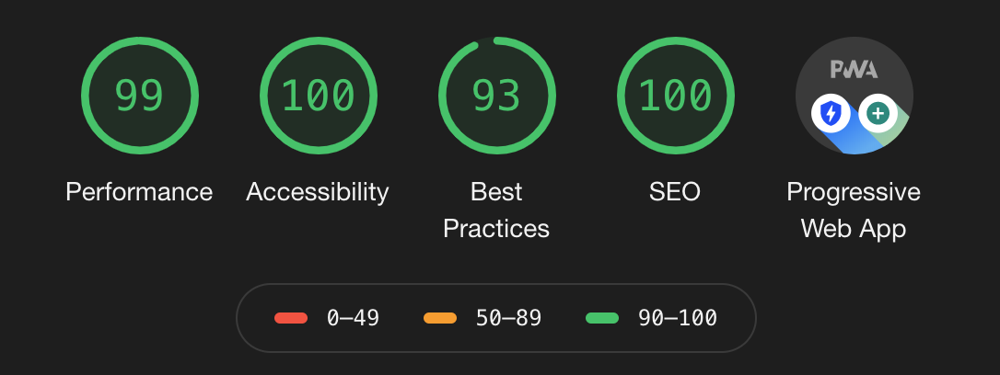
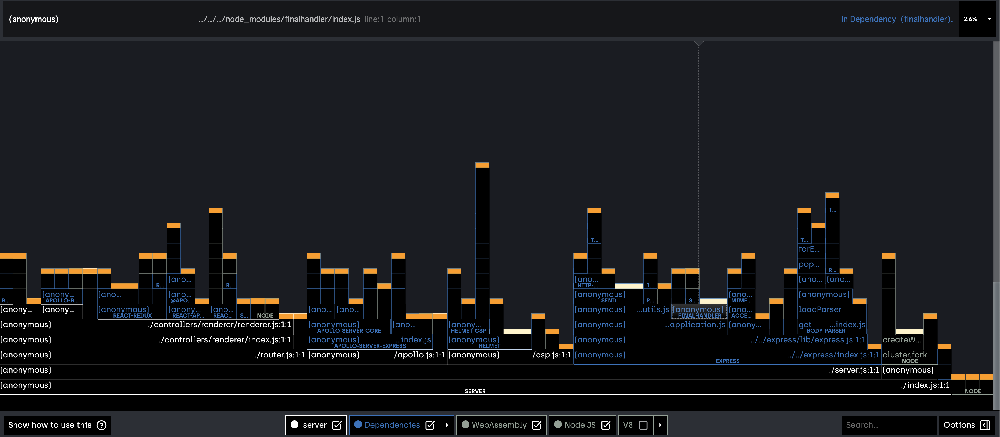

# A minimum sample of Server-Side-Rendering, Single-Page-Application and Progressive Web App

## What's this project?

This project introduces how to implement SSR, SPA, and PWA.

### Articles

only Japanese

- [N/A]()
- [業務で使える簡単な SSR + SPA のテンプレートを公開した](http://blog.hiroppy.me/entry/ssr-sample)

## Feature

This project shows several implementations like below.

- Server Side Rendering
- Single Page Application
- Progressive Web App
- GraphQL
- RESTful API
- Security (CSP, GraphQL)
- Testing
- Infra like the building tools
- Measuring performance

## Libraries

### Dependencies

| Name                | Purpose                | CSR | SSR | Note |
| ------------------- | ---------------------- | --- | --- | ---- |
| react               | view                   | yes | yes |      |
| redux               | architecure            | yes | yes |      |
| react-router        | routing                | yes | yes |      |
| react-helmet        | head tag               | yes | yes |      |
| redux-saga          | side effects           | yes | yes |      |
| styled-components   | CSS in JS              | yes | yes |      |
| loadable-components | dynamic import         | yes | yes |      |
| apollo-boost        | GraphQL                | yes | yes |      |
| express             | server side framework  | N/A | yes |      |
| nanoid              | Creating a random hash | N/A | N/A |      |

### DevDependencies

| Name              | Purpose                                      | Note |
| ----------------- | -------------------------------------------- | ---- |
| typescript        | Alt                                          |      |
| webpack           | a bundler for client side                    |      |
| babel             | transpile typescript and loadable-components |      |
| storybook         | preview                                      |      |
| storyshots        | snapshot tests                               |      |
| jest              | test runner                                  |      |
| testing-library   | a helper to test react                       |      |
| nodemon           | a watcher for server side                    |      |
| prettier          | formatter                                    |      |
| typescript-eslint | linter                                       |      |
| workbox           | service worker                               |      |
| clinic            | performance profiling                        |      |
| autocannon        | benchmarking tool                            |      |

## Pages

See the router: [src/client/router/](src/client/router/).

This application has 3 pages and creates SPA based on redux and redux-saga.  
Saga page and Apollo page use same components so you can compare each implementation.

### Top

This page reads README.md using `babel-plugin-macro`.

src: [src/client/components/pages/Top](src/client/components/pages/Top)

### Saga

This page runs just redux-saga application.

page src: [src/client/components/pages/Saga](src/client/components/pages/Saga)

### Apollo

This page runs just apollo application.

page src: [src/client/components/pages/Apollo](src/client/components/pages/Apollo)

## Control SSR and SPA

design concept: [gist](https://gist.github.com/hiroppy/9b5daf8da5cd639a62a917d536f5dfc5)  
src: [src/client/sagas/pages.ts](src/client/sagas/pages.ts)

All pages fork saga processes.

- `appProcess`
  - a common processing to execute on all pages(e.g. confirming login, sending to GA, etc...)
- pages
  - `loadTopPage`, `loadingApolloPage`
    - just stop saga when it ran at a server
  - `loadSagaPage`
    - fetching data and then stopping if it ran at a server

`appProcess` and `pages` run in parallel, also they run the same code in a server and client.

**Need to call `END` when running on Node.js**

If you do SSR using redux-saga, you have to stop redux-saga process when all processes are finished.

```js
try {
  // fetch...

  yield put(success());
} catch (err) {
  yield put(failure(err));
} finally {
  if (!process.env.IS_BROWSER) {
    yield put(END);
  }
}
```

## Global Variables

src: [src/server/controllers/renderer/renderer.tsx](src/server/controllers/renderer/renderer.tsx).

Use the following variables to pass data acquired by a server to the client side.

### `data-json`

This script tag has state and data which are fetched via redux-saga, etc at the server.

`<script id="initial-data" type="text/plain" data-json=...></script>`.

### `window.__APOLLO_STATE__`

This variable has GraphQL data which are fetched at the server.

## Lighthouse



If you want to get 100 point for Best Practices, you need to set a reverse proxy server like Nginx because Express hasn't implemented http/2 yet.(also Performance)

## Setup

```sh
$ git clone git@github.com:hiroppy/ssr-sample.git
$ cd ssr-sample
$ npm i
```

## Development

```sh
$ npm start
$ open http://localhost:3000

# GraphQL Playground
$ open http://localhost:3000/graphql
```

## Storybook

```sh
$ npm run start:storybook
$ open http://localhost:6006
```

## Test

```sh
$ npm test
```

## Production

```sh
$ npm run build             # npm run build:client + npm run build:server
$ npm run start:prod        # run server and use 3000
$ open http://localhost:8080
```

## Deploy

```sh
$ npm run deploy:storybook
```

## Performance

```sh
$ npm run build
$ npm run start:prod
$ npm run benchmark # rps

Running 10s test @ http://localhost:8080
100 connections

┌─────────┬────────┬────────┬────────┬─────────┬───────────┬───────────┬────────────┐
│ Stat    │ 2.5%   │ 50%    │ 97.5%  │ 99%     │ Avg       │ Stdev     │ Max        │
├─────────┼────────┼────────┼────────┼─────────┼───────────┼───────────┼────────────┤
│ Latency │ 161 ms │ 406 ms │ 829 ms │ 1277 ms │ 413.26 ms │ 191.69 ms │ 2649.38 ms │
└─────────┴────────┴────────┴────────┴─────────┴───────────┴───────────┴────────────┘
┌───────────┬─────────┬─────────┬─────────┬─────────┬─────────┬────────┬─────────┐
│ Stat      │ 1%      │ 2.5%    │ 50%     │ 97.5%   │ Avg     │ Stdev  │ Min     │
├───────────┼─────────┼─────────┼─────────┼─────────┼─────────┼────────┼─────────┤
│ Req/Sec   │ 210     │ 210     │ 233     │ 264     │ 236.6   │ 18.87  │ 210     │
├───────────┼─────────┼─────────┼─────────┼─────────┼─────────┼────────┼─────────┤
│ Bytes/Sec │ 3.16 MB │ 3.16 MB │ 3.51 MB │ 3.98 MB │ 3.56 MB │ 284 kB │ 3.16 MB │
└───────────┴─────────┴─────────┴─────────┴─────────┴─────────┴────────┴─────────┘

Req/Bytes counts sampled once per second.

$ npm run benchmark:flame # flamegraph
```



## Note

This repository shows how to write and so does not introduce Atomic Design.
